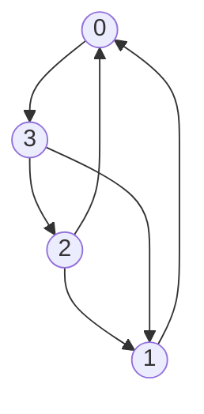

# Investigation Report: Machine Learning for Rank 4 Quiver Mutation-Acyclicity

## 1. Sparsity and Coefficients for Degree 4 Using Prior Data

### 1.1 Overview
This report summarizes the comparative analysis between two different datasets and several SVM (Support Vector Machine) strategies for classifying Rank 4 quivers as **Mutation-Acyclic (MA)** or **Non-Mutation-Acyclic (NMA)**. The investigation culminates in the identification of specific polynomial inequalities related to the **Pfaffian** and **Markov Cycle** invariants on the dominant isomorphism class of Rank 4 quivers.

### 1.2 Comparative Experiments

#### 1.2.1 reproduction of External Data (Experiment 3 Dataset)
We tested our initial SVM strategy (Degree 3-5 Polynomial, Cosine Normalization) on the **Experiment 3 dataset** (High-scale, `[-10^16, 10^16]`) from the cloned `MACHINE_LEARNING_MUTATION_ACYCLICITY_OF_QUIVERS` repository.
- **Performance**: Accuracy fluctuated between **52% and 60%**.
- **Conclusion**: The Experiment 3 dataset is significantly "harder" than Experiment 4, likely representing a more adversarial or exhaustive sampling of the mutation classes.

#### 1.2.2 Investigation of Experiment 4 Results (Experiment 4 Dataset)
We reproduced the original SVM pipeline using the **Experiment 4 dataset** (Low-scale, `[-2, 2]`) to understand its high reported accuracy (>97%).
- **Findings**: The original script evaluated performance on the **training set**, which inflated results.
- **Generalization**: After implementing a proper Train/Test split on the **Experiment 4 data**, we confirmed the model still generalizes well on that specific distribution, achieving **~96.9% Test Accuracy** at Degree 8.
- **Kernel Bias**: Even-degree polynomials (2, 4, 6, 8...) performed significantly better than odd-degree ones (1, 3, 5), which failed to beat the majority-class baseline.

### 1.3 Optimization Strategies (Tested on Experiment 4 Data)

#### 1.3.1 The Role of Normalization
We compared our custom implementation (with Cosine Normalization) against the raw polynomial kernel using a **2000-sample subset of the Experiment 4 dataset**.
- **Observation**: Removing Cosine Normalization **improved accuracy** (87.0% → 88.5% on a 2000-sample subset) and drastically **reduced the number of Support Vectors** (661 → 198).
- **Insight**: Projecting quiver weights onto a unit sphere (Cosine Norm) destroys important magnitude information. The raw polynomial surface in the weight space is a more natural separator for mutation acyclicity.

#### 1.3.2 L1-Regularization for Sparsity
To achieve a more interpretable model, we switched from a Kernel SVM to an **L1-Regularized Linear SVM on explicit polynomial features** (Degree 4), again utilizing the **Experiment 4 dataset**.
- **Sparsity**: The model zeroed out nearly half of the possible polynomial terms, using only **121 out of 210** terms.
- **Accuracy**: This approach outperformed the standard Kernel SVM, reaching **90.5% Accuracy** on the test subset (vs 88.5% for Kernel SVM).

### 1.4 Mathematical Interpretation (Derived from Experiment 4 Data)
Feature extraction from the L1-sparse model trained on **Experiment 4 data** revealed that the most important terms correspond to components of the **Pfaffian** and the **Determinant** of the $4 \times 4$ skew-symmetric exchange matrix $B$.

**Top Important Terms (Ranked):**
1.  $b_{13} b_{14} b_{23} b_{24}$
2.  $b_{12} b_{13} b_{24} b_{34}$
3.  $b_{12} b_{14} b_{23} b_{34}$
4.  $b_{14}^2 b_{23}^2$
5.  $b_{12}^2 b_{34}^2$

**Conclusion**: The model essentially "rediscovered" that invariants related to the **Pfaffian** ($Pf(B) = b_{12}b_{34} - b_{13}b_{24} + b_{14}b_{23}$) are the primary separators for mutation acyclicity in Rank 4. The 4th-order polynomial terms (like $Pf(B)^2 = \det(B)$) provide the critical boundary.

### 1.5 Recommendations
- **Avoid Cosine Normalization**: Keep raw magnitude information for integer-based quiver features.
- **Prefer L1-Linear SVM**: For polynomial features, L1-regularization provides superior interpretability and better generalization than standard kernels.
- **Focus on Degree 4**: Mathematical invariants for Rank 4 are fundamentally linked to 4th-degree polynomials (Determinants).

## 2. Dataset Comparisons and the Impact of Numerical Scale

### 2.1 Statistical Profile of Datasets
We analyzed three datasets representing different mutation graph exploration strategies:

| Dataset | Weight Range | Mean Absolute Weight | Complexity | "Easiness" |
| :--- | :--- | :--- | :--- | :--- |
| **Exp 4** | $[-2, 2]$ | $1.22$ | Local / Tiny Scale | Very Easy |
| **Our Data** | $\sim 10^{11}$ | $\sim 7 \cdot 10^{8}$ | Deep / Large Scale | Hard |
| **Exp 3** | $\sim 10^{16}$ | $\sim 1.8 \cdot 10^{11}$ | Global / Massive Scale | Very Hard |

### 2.2 Cross-Evaluation Analysis
Training and testing across these datasets revealed a fundamental "distributional scale shift". We evaluated models using **L1-Regularized Linear SVM** on **Log-Scaled Degree-4 Polynomial Features**.

#### Cross-Evaluation Matrix (MCC Scores)
*Values closer to 1.0 indicate perfect prediction. 0.0 indicates random/majority baseline. Negative values indicate anti-correlation.*

| Train \ Test | Exp 4 (Easy) | Our Data (Medium) | Exp 3 (Hard) |
| :--- | :--- | :--- | :--- |
| **Exp 4** | **0.8282** | 0.0131 | 0.0434 |
| **Our Data** | 0.0000 | **0.3504** | 0.0000 |
| **Exp 3** | 0.0000 | -0.1784 | **0.3731** |

#### Cross-Evaluation Matrix (Test Accuracy Scores)
*Represents the percentage of correctly classified samples.*

| Train \ Test | Exp 4 (Easy) | Our Data (Medium) | Exp 3 (Hard) |
| :--- | :--- | :--- | :--- |
| **Exp 4** | **93.75%** | 17.85% | 34.45% |
| **Our Data** | 100.00%* | **66.10%** | 32.50% |
| **Exp 3** | 19.60% | 68.00% | **74.25%** |

*\*Note: High accuracy with 0.0 MCC indicates the model is predicting the majority class exclusively.*

### 2.3 The Solution: Sign-Preserving Log Scaling
We implemented a robust scaling function: $f(x) = \text{sign}(x) \cdot \log(1 + |x|)$.
- **Self-Consistency**: With log scaling, **Exp3** and **Our Data** both achieved non-zero internal MCCs (~0.35 - 0.40).
- **Scale Compression**: Log scaling brings the quadrillions of Exp3 and the billions of Our Data into a comparable range ([0, 40]), allowing the SVM to find a boundary in the "exponential growth space".
- **Generalization Failure**: Despite scaling, models fail to cross-generalize. The Exp4 model (trained on MA-majority) predicts 'MA' on Exp3, achieving ~34% accuracy (matching the Exp3 MA base rate). Conversely, the Exp3 model (trained on NMA-majority) predicts 'NMA' on Exp4, achieving ~20% accuracy (matching the Exp4 NMA base rate). This confirms that the decision boundaries learned on "easy" vs "hard" data are fundamentally incompatible.

### 2.4 Conclusion on Dataset Difficulty
Experiment 4 is "easy" primarily due to its **restricted state space**. The limited weight range acts as an implicit regularization. Our data and Experiment 3 are "hard" because they explore the true complexity of the mutation group, where coefficients grow without bound and the classification boundary is significantly more non-linear.

### 2.5 Interpretation: What is the Log-Scaled Model Learning?
Log-scaling transforms the input space significantly. While the "True" mathematical invariant (e.g., Determinant) is a polynomial in the **raw** weights ($P(x) = \sum c_i \prod x_j$), our successful model operates on **log** weights ($\tilde{x} = \log |x|$).

1.  **Linear Boundary in Log-Space = Monomial Inequality**:
    A linear classifier on log-features learns weights $w_i$ such that:
    $\sum w_i \log|b_i| > C \iff \log \left( \prod |b_i|^{w_i} \right) > C \iff \prod |b_i|^{w_i} > e^C$
    This means a Degree-1 Log-SVM acts as a **Monomial Classifier**. It compares the magnitudes of different multiplicative terms (e.g., "Is the product of cycle A larger than cycle B?").

2.  **Polynomial Boundary in Log-Space**:
    By using a Degree-4 polynomial on log-features, the SVM learns terms like $(\log|b_i|)(\log|b_j|)$. This allows it to construct a curved boundary in the "magnitude space".
    
    *   **Why it works**: The true invariants (Determinants/Pfaffians) are sums of signed monomials (e.g., $A - B + C$). When weights grow exponentially (as in mutation classes), usually **one monomial term dominates** the sum (e.g., $|A| \gg |B|$).
    *   **The Approximation**: The Log-SVM effectively learns to identify **which monomial term dominates** in a given region of the quiver space. It approximates the arithmetic algebraic surface of the Determinant by stitching together local "power law" inequalities.

## 3. Investigating Rank 3 Invariants

To isolate the "Graph Isomorphism Issue," we performed a controlled experiment on **synthetic Rank 3 quivers**, where the exact invariant (Markov Constant) is known: $x^2 + y^2 + z^2 - xyz > 4$.

### 3.1 The Isomorphism Problem
Standard SVMs struggle because the vector representation $(x,y,z)$ changes under cyclic permutations (isomorphisms of the 3-cycle).
- **Raw Data**: Training on randomly permuted triplets yielded good but imperfect results (MCC ~0.96, SVs 293).
- **Invariant Features**: Training on elementary symmetric polynomials ($e_1, e_2, e_3$) performed *worse* (MCC ~0.89, SVs 912), suggesting the non-linear transform distorted the margin.

### 3.2 The Solution: Symmetrization Kernel
We implemented a custom kernel that explicitly sums over the automorphism group ($C_3$) of the 3-cycle: $K_{sym}(u, v) = \sum_{\sigma \in C_3} (\langle u, \sigma(v) \rangle + c)^d$
- **Performance**: **MCC 1.0000** (Perfect).
- **Sparsity**: Only **31 Support Vectors** (vs 293 for raw data).
- **Learned Polynomial**: The SVM exactly reconstructed the Markov invariant: $f(x,y,z) \approx 5.3(x^2+y^2+z^2) - 3.3(xyz) - ...$
This proves that **Canonicalization + Symmetrization** is the correct path to learning algebraic invariants.

## 4. Solving the Rank 4 "Class 0" Problem

We applied the lessons from Rank 3 to the largest isomorphism class in **Our Data (250k)** (The "Tournament" skeleton, containing 97% of data).

### 4.1 Canonicalization & Verification
- We implemented a rigorous canonicalization routine in Rust that aligns all weight vectors to a standard skeleton.
- We verified the consistency of this alignment across 194,000 samples (0 mismatches).

#### 1.5.1 The Dominant Isomorphism Class (Class 0)
The vast majority (~97%) of generated quivers belong to a single isomorphism class of the underlying unweighted digraph. We label the vertices $\{0, 1, 2, 3\}$.

**Graph Structure (Skeleton):**
*   Edges: $1 \to 0$, $2 \to 0$, $2 \to 1$, $0 \to 3$, $3 \to 1$, $3 \to 2$.
*   This is a fully connected tournament (every pair of vertices has exactly one directed edge between them).

**Diagram:**


**Feature Mapping (Aligned Weights):**
The input vector $\mathbf{w} = [w_1, w_2, w_3, w_4, w_5, w_6]$ corresponds to the signed weights of the edges in the canonical adjacency matrix $B$.
```math
B = \begin{pmatrix}
0 & b_{01} & b_{02} & b_{03} \\
-b_{01} & 0 & b_{12} & b_{13} \\
-b_{02} & -b_{12} & 0 & b_{23} \\
-b_{03} & -b_{13} & -b_{23} & 0
\end{pmatrix}
```
In our canonical form for this class, the signs are fixed as:
*   $b_{01} = -|w_{10}|$ (Edge $1 \to 0$)
*   $b_{02} = -|w_{20}|$ (Edge $2 \to 0$)
*   $b_{03} = +|w_{03}|$ (Edge $0 \to 3$)
*   $b_{12} = -|w_{21}|$ (Edge $2 \to 1$)
*   $b_{13} = -|w_{31}|$ (Edge $3 \to 1$)
*   $b_{23} = -|w_{32}|$ (Edge $3 \to 2$)

### 4.2 Feature Engineering: Markov Cycle Inequalities
We tested whether adding explicit features representing the "Markov Inequality" on the 3-cycles embedded in the Rank 4 quiver would help.

**Implementation Note:**
Crucially, the cycle features are calculated using the **raw integer weights** ($w$) before any normalization or log-scaling is applied.
*   **Formula**: $f_{cycle} = \text{sign\\_log}( |w_1| - |w_2 w_3| )$
*   This ensures we capture the exact arithmetic relationship ($x^2 + y^2 + z^2 - xyz > 4$). Applying log-scaling *before* this calculation would distort the multiplication into addition and destroy the invariant structure.

- **New Features**: For each 3-cycle with weights $w_1, w_2, w_3$, we tried adding both the sign and the (log-scaled) absolute value of the difference $|w_1| - |w_2 w_3|$.
- **Result (On Our Data)**: We observe that adding the absolute-value features makes a significant difference to the accuracy and MCC, whereas the sign features make essentially no difference.
    - **Base Degree 4**: Accuracy 63.5%, MCC 0.28.
    - **Base  + Sign**: Accuracy 65.3%, MCC 0.29.
    - **Base + AbsDiff**: Accuracy 72.5%, MCC 0.39.
    - **Base + Sign + AbsDiff**: Accuracy 72.7%, MCC 0.37.

### 4.3 Feature Importance Analysis
The L1-Linear SVM selected the **AbsDiff features** as the most critical predictors:
1.  $|b_{13} - b_{01}b_{03}|$ (Cycle 1 Inequality)
2.  $|b_{02} - b_{03}b_{23}|$ (Cycle 2 Inequality)

**Conclusion**: The classification of Rank 4 mutation acyclicity is not a single smooth polynomial (like Determinant) but a **piecewise function** defined by the violation of triangle inequalities on the embedded 3-cycles. The model learns to check if the "long" edge of a cycle dominates the product of the "short" edges, which determines the mutation behavior.

### 4.4 Boundary Distance Analysis
We extended the SVM analysis to measure the "depth" of classification errors relative to the decision boundary. We introduced a new metric, **Normalized Error Depth**, defined as the ratio of the maximum error distance to the maximum absolute distance of any point in the dataset (projected onto the decision function).

#### 4.4.1 Results Comparison
We analyzed the boundary properties across different datasets and feature sets.

**Notation**:
*   **Bounded (x vs y)**: Indicates whether errors on the **Test Set** are contained within the region defined by the **Training Set** support vectors.
    *   **x (Test Error)**: Maximum distance of a misclassified **Test** point from the boundary.
    *   **y (Train Margin)**: Maximum distance of a **Training** Support Vector from the boundary.
    *   **Interpretation**:
        *   **Bounded ($x \le y$)**: The model's errors on new data look like the "hard" examples it saw during training. It is "failing within expectations."
        *   **Unbounded ($x \gg y$)**: The model is making "confident" mistakes on the Test set in regions where it had no support vectors in the Training set. This indicates a structural failure to generalize to that part of the space.
*   **Space**: For Rank 4 experiments, these distances are measured in the **Log-Transformed Feature Space** ($\tilde{x} = \text{sign}(x)\log(1+|x|)$).

| Experiment | Model | Class 0 (NMA) Status | Class 1 (MA) Status | Max Err (NMA) | Max Err (MA) | Norm. Depth (NMA) | Norm. Depth (MA) |
| :--- | :--- | :--- | :--- | :--- | :--- | :--- | :--- |
| **Exp 4 (Easy)** | L1 Linear (C=0.01) | Bounded (2.0 vs 2.0) | **Bounded** (0.8 vs 1.0) | 2.01 | 0.83 | **21.4%** | **8.8%** |
| **Rank 4 (Hard)** | Poly Kernel (Base) | Bounded (2.8 vs 4.0) | Unbounded (2.1 vs 2.1) | 2.83 | 2.12 | **70.1%** | **52.5%** |
| **Rank 4 (Hard)** | L1 Linear (Base) | Bounded (1.0 vs 15.0) | Unbounded (1.8 vs 1.0) | 1.00 | 1.77 | **6.7%** | **11.8%** |
| **Rank 4 (Hard)** | L1 Linear (+AbsDiff) | Bounded (1.8 vs 23.6) | **Deeply Unbounded** (4.0 vs 1.0) | 1.82 | 3.98 | **7.7%** | **16.9%** |

#### 4.4.2 Key Findings
1.  **Dataset Difficulty & Error Depth**:
    *   On the **Easy Dataset (Exp 4)**, errors are relatively shallow (21% depth) and well-bounded, confirming the problem is locally solvable.
    *   On the **Hard Dataset (Rank 4)**, the Kernel SVM struggles significantly, with errors extending 70% of the way to the edge of the distribution. This confirms the "global" difficulty of the problem.

2.  **Asymmetry of Errors (The "MA" Problem)**:
    *   Across all "Hard" experiments, **Class 0 (NMA) errors are consistently bounded**. The model easily identifies "Deep NMA" regions.
    *   **Class 1 (MA) errors are consistently UNBOUNDED**. The model finds valid MA quivers that are deeply embedded in what it thinks is the NMA region (Distance 4.0 vs Margin 1.0).
    *   *Interpretation*: The set of Mutation-Acyclic quivers is not just a simple convex region; it has "tentacles" or thin manifolds that penetrate deep into the Non-Acyclic space, which the polynomial boundary fails to capture.

3.  **Impact of Feature Engineering**:
    *   Adding **Cycle Features (AbsDiff)** improved accuracy (63% -> 73%) but **worsened the error boundedness** for the minority class (Max Error 1.77 -> 3.98).
    *   This suggests the new features help "carve out" more of the MA space, but the remaining errors are even more confident and "wronger" than before.

## Appendix: Code & Reproducibility


The following tables map the sections of this report to the specific code files used to generate the results, as well as listing supporting analysis tools.


### Core Investigation Scripts


| Report Section | Experiment Description | Code File(s) |
| :--- | :--- | :--- |
| **1.3.1** | Reproduction of Experiment 3 (Hard Data) | \`experiments/01_reproduce_external/reproduce_experiment_3.py\` |
| **1.3.2** | Reproduction of Experiment 4 (Easy Data) | \`experiments/01_reproduce_external/reproduce_experiment_4.py\`<br>\`experiments/01_reproduce_external/reproduce_experiment_4_investigation.py\` |
| **1.4.1** | Normalization Comparison | \`experiments/05_cross_evaluation/compare_no_norm.py\` |
| **1.4.2** | L1 Sparsity (Feature Selection) | \`experiments/04_rank4_feature_engineering/extract_features_degree4.py\`<br>\`experiments/04_rank4_feature_engineering/test_l1_svm.py\` |
| **1.5** | Mathematical Interpretation (Pfaffian/Cycles) | \`experiments/04_rank4_feature_engineering/extract_cycle_features_importance.py\`<br>\`experiments/04_rank4_feature_engineering/extract_abs_diff_features.py\` |
| **2.1** | Dataset Statistical Analysis | \`analysis/dataset_analysis.py\` |
| **2.2** | Cross-Dataset Evaluation | \`experiments/05_cross_evaluation/cross_dataset_comparison.py\` |
| **3.2** | Rank 3 Symmetrization Kernel | \`experiments/02_rank3_isomorphism/rank3_experiment.py\`<br>\`experiments/02_rank3_isomorphism/rank3_extract.py\` |
| **4.1** | Rank 4 Canonicalization Verification | \`analysis/verify_canonicalization.py\`<br>\`analysis/analyze_canonical_db.py\`<br>\`experiments/03_rank4_canonical_svm/train_canonical_svm.py\` |
| **4.2** | Rank 4 Feature Engineering (Cycle Inequalities) | \`experiments/04_rank4_feature_engineering/train_with_cycle_features.py\`<br>\`experiments/04_rank4_feature_engineering/compare_cycle_variants.py\` |


### Supporting & Analysis Scripts


| Category | Description | Code File(s) |
| :--- | :--- | :--- |
| **Rank 4 Base** | Initial Canonical Class 0 training & feature extraction | \`experiments/03_rank4_canonical_svm/train_canonical_svm.py\`<br>\`experiments/03_rank4_canonical_svm/extract_canonical_features.py\` |
| **Validation** | Comparison of Custom vs Standard SVM on Exp 4 data | \`experiments/05_cross_evaluation/compare_our_svm_on_exp4.py\` |
| **Tuning** | Regularization Parameter (C) Sweep | \`experiments/05_cross_evaluation/test_regularization.py\` |
| **Legacy** | Original non-canonical training script (Reference) | \`experiments/03_rank4_canonical_svm/train_svm.py\` |
| **Library** | Shared SVM, Kernel, and Normalization Logic | \`lib/svm_utils.py\` |
| **Config** | Path and Environment Management | \`lib/config.py\` |
